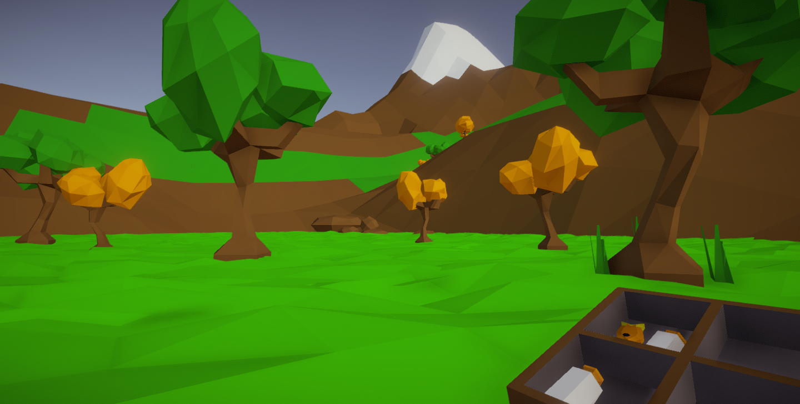

# Kittler
Kittler is a puzzler experience created for Udacity VR Nanodegree as a 4th project using Unity Game engine. It is a simple puzzle game where you solve a memory puzzle in order to get food and feed your lovely kitten. 

Time Taken: 3 weeks

### Features
* Lovely low poly environment
* Interactive sound when clicking buttons
* Most of the sound effects are recorded by my siblings and I
* Simple memory puzzle that gets harder as you win
* Puzzle support different colors and sound pitch for variation
* Two different types of food that you choose
* iTween for smooth motion
* Hidden "Reset All Data" button
* Available on both Android and PC. Check "Download Link" section for details

### Software/ Plugins Used
* Unity Engine 5.6.0
* Google VR SDK 1.5
* iTween/ iTween Path
* Post Processing Stack
* 3Ds Max
* Microsoft Paint

### Download Link
Download now from itch.io by clicking [here](https://mickeysupers.itch.io/kittler)

### More Information
You can read about the process of creating this project here: https://medium.com/@MohammedAlsayed/kittler-vr-1adb311226c

More information about the course at: https://classroom.udacity.com/nanodegrees/nd017

## License
This project is licensed under the MIT License - see the [LICENSE.md](LICENSE.md) file for details